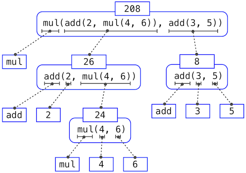

# Chapter 1: Building Abstractions with Functions

## 1.1 Getting Started

### Interactive Sessions

- Interactive sessions

  In an **interactive Python session**, you type some Python code after the prompt, `>>>`. The Python **interpreter** reads and executes what you type, carrying out your various commands.

- Control commands in sessions

  - History
  
    Each session keeps a history of what you have typed. 
    
    To access that history, press `<Control>-P` (previous) and `<Control>-N` (next). 
    
    Up and down arrows also cycle through history on some systems.

  - Exit
    
    `<Control>-D` exits a session, which discards this history. 

### Statements and Expressions

Broadly, computer programs consist of **instructions** to either

1. Carry out some action
2. Compute some value

Likewise, Python code consists of **statements** and **expressions**. 

Each type of expression or statement has its own evaluation or execution procedure.

- Statement

  Statements typically describe **actions**. They are not evaluated but executed. When the Python **interpreter** executes a statement, it carries out the corresponding action(change) instead of producing a value. 

  - Statement example

    The assignment statement

    ``` python
    >>> shakespeare = urlopen('http://composingprograms.com/shakespeare.txt')
    ```

    associates the name `shakespeare` with the value of the **expression** that follows `=`. That expression applies the `urlopen` function to a URL that contains the complete text of William Shakespeare's 37 plays, all in a single text document.

  - Python **code** is a sequence of statements.

- Expression

  On the other hand, expressions typically describe **computations**. When Python evaluates an expression, it computes the **value** of that expression. 

  When you enter an **expression** in an interactive session, Python prints its value on the **following line**.

- Relationship between statements and expressions

  Statements **govern the relationship** among different expressions in a program and what happens to their results.

  - Statements contain subexpressions

    Statements are not expressions, although some of them contain expressions as components. And executing statements can involve **evaluating subexpressions** contained within them.

  - Expressions can be executed as statements

    Expressions by themselves are valid statements, so they can also be executed as statements, in which case they are evaluated, but their value is **discarded**. 
    
    Executing a pure function has no effect, but executing a non-pure function can cause effects as a consequence of function application.

### Functions, Objects, and Interpreters

- Function

  Functions encapsulate **logic that manipulates data**. 
  
  `urlopen` is a **function**. A web address is a piece of **data**, and the text of Shakespeare's plays is **another**. 
  
  The process by which the former leads to the latter may be **complex**, but we can apply that process using only a **simple expression** because that complexity is tucked away within a function.

  Functions are the primary topic of this chapter.

- Object

  An object seamlessly bundles together **data** and the **logic** that manipulates that data, in a way that manages the complexity of both. 
  
  Objects are the primary topic of Chapter 2. 

- Interpreter

  Evaluating **compound expressions** requires a precise procedure that interprets code in a predictable way. A program that implements such a procedure, evaluating compound expressions, is called an interpreter. 
  
  The design and implementation of interpreters is the primary topic of Chapter 3.

### Debugging Guide

1. Test incrementally.
2. Isolate errors.
3. Check your assumptions.
4. Consult others.

## 1.2 Elements of Programming

- Programs for people to read

  Programs serve to communicate those ideas among the members of a programming community. 
  
  Thus, programs must be written **for people to read**, and only incidentally for machines to execute.

- Three mechanisms of programming languages

  When we describe a language, we should pay particular attention to the **means** that the language provides for combining simple ideas to form more complex ideas. 
  
  Every powerful language has three such mechanisms:

  - primitive expressions and statements
    
    which represent the simplest building blocks that the language provides,
  
  - means of combination
    
    by which compound elements are built from simpler ones, and
  
  - means of abstraction
    
    by which compound elements can be named and manipulated as units.

- Two kinds of elements of Programming

  In programming, we deal with two kinds of elements: functions and data. (Soon we will discover that they are really not so distinct.)

  Informally, data is stuff that we want to manipulate, and functions describe the rules for manipulating the data. 
  
  Thus, any powerful programming language should be able to describe primitive data and primitive functions, as well as have some methods for **combining** and **abstracting** both functions and data.

### Expressions

- Primitive expression

  We begin with primitive expressions. One kind of primitive expression is a number. 

  <span class = "thought">Primitive expressions include name, function content, and data content.</span>

  <span class = "thought">A primitive expression requires only a **single** evaluation step.</span>

- Compound expression

  - Infix notation

    **Expressions** representing numbers may be combined with **mathematical operators** to form a compound expression, which the interpreter will evaluate:

    ``` python
    >>> -1 - -1
    0
    >>> 1/2 + 1/4 + 1/8 + 1/16 + 1/32 + 1/64 + 1/128
    0.9921875
    ```

    These mathematical expressions use **infix** notation, where the operator (e.g., +, -, *, or /) appears **in between** the operands (numbers). 
    
  - Function notation (Call expression)

    The most important kind of **compound expression** is a **call expression**, which applies a **function** to some **arguments**. 
    
    - Functions in Python are the same as in mathematics
    
      Recall from algebra that the mathematical notion of a function is a mapping from some input arguments to an output value. For instance, the `max` function maps its inputs to a single output, which is the largest of the inputs. The way in which Python expresses function application is the **same** as in conventional mathematics.

      ``` python
      >>> max(7.5, 9.5)
      9.5
      ```

    - Subexpression
    
      This call expression has subexpressions: the operator is an **expression** that precedes parentheses, which enclose a comma-delimited list of operand **expressions**.

      The operator specifies a **function**. 
      
    When this **call expression** is evaluated, we say that the **function** `max` is called with **arguments** 7.5 and 9.5, and returns a value of 9.5.

    - Order of arguments matters

      The order of the arguments in a call expression matters. 
      
      For instance, the function `pow` raises its first argument to the power of its second argument.

      ``` python
      >>> pow(100, 2)
      10000
      >>> pow(2, 100)
      1267650600228229401496703205376
      ```

  - Advantages of function notation over infix one

    Function notation has three principal advantages over the mathematical convention of infix notation. 

    1. Functions may take an arbitrary number of arguments. 
    
       No ambiguity can arise, because the function name always precedes its arguments.

    2. Function notation extends in a straightforward way to **nested expressions**, where the elements are themselves **compound expressions**. 
       
       In nested call expressions, unlike compound infix expressions, the structure of the nesting is entirely explicit in the parentheses.

       ``` python
       >>> max(min(1, -2), min(pow(3, 5), -4))
       -2
       ```

    3. Function notation is unified 

       Mathematical notation has a great variety of forms: multiplication appears between terms, exponents appear as superscripts, division as a horizontal bar, and a square root as a roof with slanted siding. 
       
       Some of this notation is very hard to type! 
       
       However, all of this complexity can be **unified** via the notation of call expressions. 
       
       While Python supports common mathematical operators using infix notation (like + and -), any operator can be expressed as a function with a name.

### Importing Library Functions

- The Python Library

  Python defines a very large number of functions, but does not make all of their names available by default. Instead, it organizes the functions and other quantities that it knows about into **modules**, which together comprise the **Python Library**. 

- How to use 

  To use these elements, one **imports** them. 
  
  - Examples

    For example, the `math` module provides a variety of familiar mathematical functions:

    ``` python
    >>> from math import sqrt
    >>> sqrt(256)
    16.0
    ```

    and the `operator` module provides access to functions corresponding to infix operators:

    ``` python
    >>> from operator import add, sub, mul
    >>> add(14, 28)
    42
    >>> sub(100, mul(7, add(8, 4)))
    16 
    ```
  - `import` statement

    An `import` statement designates a **module name** (e.g., `operator` or `math`), and then lists the **named attributes** of that module to import (e.g., `sqrt`). 
    
    Once a function is imported, it can be called multiple times.

### Names, Bindings, and, the Environment

A critical aspect of a programming language is the means it provides for using names to refer to computational objects. 

- Names

  In Python, names are often called **variable names** or **variables** because they can be bound to **different values** in the course of executing a program. 
  
  When a name is bound to a new value through **assignment**, it is no longer bound to any previous value. 
  
  - Built-in names can be bound to new values
  
    One can even bind **built-in names** to new values.

    ``` python
    >>> max = 5
    >>> max
    5
    ```

- Bindings from names to values

  If a value has been given a name, we say that the name **binds** to the value.
  
- Bindings from names to functions

  Names can also be bound to functions. For instance, the name `max` is bound to the max function we have been using. 
  
  Functions, unlike numbers, are tricky to render as text, so Python prints an identifying description instead, when asked to describe a function:

  ``` python
  >>> max
  <built-in function max>
  ```

- Existing bindings

  <span class = "thought">There are already some **built-in** function bindings and constant bindings.</span>

- Establish new bindings from names to values
  
  In Python, we can establish new bindings using the **assignment statement**, which contains a name to the left of `=` and a value to the right:

  ``` python
  >>> radius = 10
  >>> radius
  10
  >>> 2 * radius
  20
  ```

  The `=` symbol is called the **assignment operator** in Python (and many other languages). 

  Assignment is our **simplest** means of **abstraction**, for it allows us to use **simple names** to refer to the results of **compound operations**.

  ***

  Names are also bound via `import` statements.

  ``` python
  >>> from math import pi
  >>> pi * 71 / 223
  1.0002380197528042
  ```
  
- Establish new bindings from names to functions
  
  We can also use assignment statements to give new names to existing **functions**.

  ``` python
  >>> f = max
  >>> f
  <built-in function max>
  >>> f(2, 3, 4)
  4
  ```

  And successive assignment statements can **rebind** a name to a new value.

  ``` python
  >>> f = 2
  >>> f
  2
  ```

  ***

  `import` statements.

  ***

  `def` statements.

- Multiple assignments

  We can also assign multiple values to multiple names in a single statement, where names on the left of = and expressions on the right of = are separated by **commas**.

  ``` python
  >>> area, circumference = pi * radius * radius, 2 * pi * radius
  >>> area
  314.1592653589793
  >>> circumference
  62.83185307179586
  ```

  - Expressions are first evaluated

    With multiple assignment, all expressions to the right of `=` are **evaluated before** any names to the left are bound to those values. 
    
    As a result of this rule, swapping the values bound to two names can be performed in a **single statement**.

    ``` python
    >>> x, y = 3, 4.5
    >>> y, x = x, y
    >>> x
    4.5
    >>> y
    3
    ```

- Environment

  The possibility of binding names to values and later retrieving those values by name means that the **interpreter** must maintain some sort of memory that keeps track of the **names**, **values**, and **bindings**. This memory is called an **environment**.

  Environments provide the context in which evaluation takes place, which plays an important role in our understanding of program execution.
  
### Evaluating Nested Expressions

- Procedure

  In evaluating nested call expressions, the interpreter is itself following a procedure.

  To evaluate a call expression, Python will do the following:

  1. Evaluate the operator and operand subexpressions, then
  2. Apply the function that is the **value** of the operator subexpression to the arguments that are the values of the operand subexpressions.

- This procedure is recursive

  The first step dictates that in order to accomplish the evaluation process for a call expression we must first evaluate other expressions. 

  Thus, the evaluation procedure is **recursive** in nature.

- Expression tree

  If we draw each expression when we evaluate `sub(pow(2, add(1, 10)), pow(2, 5))`, we get 

  

  This illustration is called an **expression tree**.

### Two Types of Functions

Throughout this text, we will distinguish between two types of functions.

- Pure functions

  Functions have some input (their arguments) and return some output (the result of applying them). 
  
  The built-in function can be depicted as a small machine that takes input and produces output.

  ``` python
  >>> abs(-2)
  2
  ```

  The function `abs` is **pure**. Pure functions have the property that applying them has no effects beyond returning a value. Moreover, a pure function must always return the same value when called twice with the same arguments.

- Non-pure functions

  In addition to returning a value, applying a **non-pure** function can generate **side effects**, which make some change to the state of the interpreter or computer. 
  
  A common side effect is to **generate additional output** beyond the return value, using the `print` function.

  ``` python
  >>> print(1, 2, 3)
  1 2 3
  ```

  - Return value
    
    The value that `print` returns is always `None`, a special Python value that represents nothing. The interactive Python interpreter does not automatically print the value `None`. In the case of `print`, the function itself is printing output as a side effect of being called.

  - Should not be the expression in assignments

    Be careful with `print`! The fact that it returns `None` means that it should not be the expression in an assignment statement.

    ``` python
    >>> two = print(2)
    2
    >>> print(two)
    None
    ```

## 1.3 Defining New Functions

- Three mechanisms illustrated

  We have identified in Python some of the elements that must appear in any powerful programming language:

  1. Numbers and arithmetic operations are primitive built-in data values and functions.
  2. **Nested function** application provides a means of combining operations.
  3. **Binding** names to values provides a limited means of abstraction.

### Function definition

Now we will learn about function definitions, a much **more powerful abstraction** technique by which a name can be bound to **compound operation**, which can then be referred to as a unit.

- How to define a function

  ``` python
  def <name>(<formal parameters>):
      ...
      return <return expression>
      ...
  ```

  - `return` statement

    The process of function application **terminates** whenever the first `return` statement is executed, and the **value** of the `return` expression is the returned value of the function being applied.

    <span class = "question">If there is no `return` statement in a function definition, `None` is returned as the return value.</span>

  - Indentation

    The second line must be indented — most programmers use four spaces to indent.

- Three kinds of functions are used in the same way

  User-defined functions, built-in functions, and imported functions are used in the same way.

- Example

  ``` python
  >>> def g():
          return 1
  >>> g()
  1
  >>> g = 2
  >>> g
  2
  >>> def g(h, i):
          return h + i
  >>> g(1, 2)
  3
  ```

### Environment Diagrams

- Frame
  
  An environment in which an expression is evaluated consists of a sequence of **frames**, depicted as **boxes**. 
  
  Each frame contains **bindings**, each of which associates a **name** with its corresponding **value**. 
  
  - Global frame
  
    There is <span class = "thought">always</span> a single global frame. 

- Environment diagram

  <span class = "thought">If we draw the sequence of frames representing an environment, we get an environment diagram.</span>

  - When will new bindings between name and data content appear

    1. `import` statements
    2. Assignment statements

  - When will new bindings between name and function appear

    1. `import` statements

       An import statement binds a name to a function in some modules.

    2. `def` statements

       A `def` statement binds a name to a user-defined function created by the definition.

    3. Assignment statements

       ``` python
       f = max
       ```

    4. Built-in functions like `max` and `min` do not appear in the diagram even when used.

       ``` python
       a = max(1, 2)
       ``` 

  - Two names of a function in a diagram

    The name of a function is repeated **twice**, once in the frame and again as part of the function itself. 
    
    - Intrinsic name
    
      The name appearing in the function is called the **intrinsic name**. 
      
    - Bound name

      The name in a frame is a **bound name**. 
      
    There is a difference between the two: different names may refer to the same function, but that function itself has only **one intrinsic name**.

- Function signatures

  A description of the **formal parameters** of a function is called the function's signature.

### Local Frame and Order of Frames

- Local frame

  Applying a user-defined function introduces a second **local frame**, which is only accessible to that function. 
  
  To apply a user-defined function to some arguments:

  1. Bind the arguments to the names of the function's formal parameters in a new local frame.
  2. Execute the body of the function in the environment that starts with this frame.

  The environment in which the body is evaluated consists of **two frames**: first the local frame that contains formal parameter bindings, then the global frame that contains everything else. 

  - Return value

    The "Return value" in a local frame of a function is not a name binding; instead it indicates the value returned by the function call that created the frame.

- Order of frames

  The order of frames in an environment affects the value returned by looking up a name in an expression.
  
  We stated previously that a name is evaluated to the value associated with that name in the current environment. We can now be more precise:

  A name evaluates to the value bound to that name in the **earliest frame** of the **current environment** in which that name is found.

- Model of evaluation

  Our conceptual framework of **environments**, **names**, and **functions** constitutes a model of evaluation.

### Local Names and Scope

This principle -- that the meaning of a function should be independent of the **parameter names** chosen by its author -- has important consequences for programming languages. The simplest consequence is that the parameter names of a function must remain **local** to the body of the function.

We say that the **scope** of a local name is limited to the body of the user-defined function that defines it. When a name is no longer accessible, it is out of scope.

### Choosing Names

1. Function names are lowercase, with words separated by underscores. Descriptive names are encouraged.
2. Function names typically evoke operations applied to arguments by the interpreter (e.g., `print`, `add`, `square`) or the name of the quantity that results (e.g., `max`, `abs`, `sum`).
3. Parameter names are lowercase, with words separated by underscores. Single-word names are preferred.
4. Parameter names should evoke the role of the parameter in the function, not just the kind of argument that is allowed.
5. Single letter parameter names are acceptable when their role is obvious, but avoid "l" (lowercase ell), "O" (capital oh), or "I" (capital i) to avoid confusion with numerals.

### Functions as Abstractions

To master the use of a **functional abstraction**, it is often useful to consider its three core attributes. 

- Domain

  The **domain** of a function is the set of arguments it can take. 
  
- Range
  
  The **range** of a function is the set of values it can return. 
  
- Intent

  The intent of a function is the relationship it computes between inputs and output (as well as any side effects it might generate). 
  
Understanding functional abstractions via their domain, range, and intent is critical to using them correctly in a complex program.

### Operators of Infix Notation and Function Notation

- Evaluation procedure for infix notation expressions

  Python expressions with infix operators each have their own evaluation procedures, but you can often think of them as short-hand for call expressions.

- Operators

  ```
  +  add
  -  sub
  *  mul
  ** pow
  /  truediv
  // floordiv
  %  mod

  lt(a, b) <
  le(a, b) <=
  eq(a, b) ==
  ne(a, b) !=
  ge(a, b) >=
  gt(a, b) >
  ```

## 1.4 Designing Functions

### What are good functions

Fundamentally, the qualities of good functions all reinforce the idea that functions are **abstractions**.

- Each function should have exactly one job
    
  That job should be identifiable with a short name and characterizable in a single line of text. 
  
  Functions that perform multiple jobs in sequence should be divided into multiple functions.

- Don't repeat yourself is a central tenet of software engineering

  The so-called DRY principle states that multiple fragments of code should not describe redundant logic. Instead, that logic should be implemented once, given a name, and applied multiple times. 
  
  If you find yourself copying and pasting a block of code, you have probably found an opportunity for functional abstraction.

- Functions should be defined generally

  Squaring is not in the Python Library precisely because it is a special case of the `pow` function, which raises numbers to arbitrary powers.

### Documentation

- Docstring

  A function definition will often include documentation describing the function, called a **docstring**, which must be indented along with the function body. 

  Docstrings are conventionally **triple quoted**. The first line describes the job of the function in one line, followed by a **blank line**. The following lines can describe arguments and clarify the behavior of the function:

  ``` python
  >>> def pressure(v, t, n):
          """Compute the pressure in pascals of an ideal gas.

          Applies the ideal gas law: http://en.wikipedia.org/wiki/Ideal_gas_law

          v -- volume of gas, in cubic meters
          t -- absolute temperature in degrees kelvin
          n -- particles of gas
          """
          k = 1.38e-23  # Boltzmann's constant
          return n * k * t / v
  ```
  
- How to access docstring

  When you call `help` with the name of a function as an argument, you see its docstring (type `q` to quit Python help).

  ``` python
  >>> help(pressure)
  ```

- Comments

  Comments in Python can be attached to the end of a line following the `#` symbol.

### Default Argument Values

In Python, we can provide default values for the arguments of a function. When calling that function, arguments with default values are optional.

``` python
>>> def pressure(v, t, n = 6.022e23):
        """Compute the pressure in pascals of an ideal gas.

        v -- volume of gas, in cubic meters
        t -- absolute temperature in degrees kelvin
        n -- particles of gas (default: one mole)
        """
        k = 1.38e-23  # Boltzmann's constant
        return n * k * t / v
```

The `=` symbol means two different things in this example, depending on the context in which it is used. 

In the `def` statement header, `=` does not perform assignment, but instead indicates a default value to use when the pressure function is called. 

By contrast, the assignment statement to `k` in the body of the function binds the name `k` to an approximation of Boltzmann's constant.

## 1.5 Control

### Compound Statements

In general, Python code is a sequence of statements. 

- Simple statement

  A simple statement is a single line that doesn't end in a colon. 
  
- Compound statement

  A compound statement is so called because it is composed of other statements (simple and compound). 
  
  - Clause
  
    A clause typically span multiple lines and start with a one-line header ending in a colon, which identifies the type of statement. 

    Specialized evaluation rules for each kind of **header** dictate when and if the statements in its **suite** are executed. 
    
    We say that the header **controls** its suite.
  
  - Syntax
  
    A compound statement consists of one or more clauses:

    ```
    <header>:
        <statement>
        <statement>
        ...
    <separating header>:
        <statement>
        <statement>
        ...
    ...
    ```

    - Indentation

      When indenting a suite, all lines must be indented the same amount and in the same way (use spaces, not tabs). 
      
      Any variation in indentation will cause an error.

  - Executing a sequence of statements is recursive

    To execute a sequence of statements, execute the first statement. If that statement does not redirect control, then proceed to execute the rest of the sequence of statements, if any remain.

    We can see that the essential structure of a sequence is **recursive**. 
    
    A sequence can be decomposed into its first element and the rest of its elements. The "rest" of a sequence of statements is itself a sequence of statements. 
    
    ***

    The important consequence of this rule is that statements are executed in order, but later statements may never be reached, because of **redirected** control.

### Conditional Statements

- Syntax

  A conditional statement in Python consists of a series of **headers** and **suites**: a required `if` clause, an optional sequence of `elif` clauses, and finally an optional `else` clause:

  ``` python
  if <expression>:
      <suite>
  elif <expression>:
      <suite>
  else:
      <suite>
  ```

- Execution rule

  When executing a conditional statement, each clause is considered in order. The computational process of executing a conditional clause follows.

  1. Evaluate the header's expression.
  2. If it is a **true value**, execute the suite. Then, skip over all subsequent clauses in the conditional statement.


- Boolean context

  The expressions inside the header statements of conditional blocks are said to be **in boolean contexts**: their truth values matter to control flow, but otherwise their values are not assigned or returned. 
  
- False value and true value

  Python includes several false values, including 0, `None`, and the **boolean value** `False`.
  
  All other numbers are true values, the **boolean value** `True` is also true value. 
  
  In Chapter 2, we will see that every built-in kind of data in Python has both true and false values.
  
  - Boolean values

    Python has two boolean values, called `True` and `False`. 
    
    Boolean values represent truth values in **logical** expressions. 
    
  - How to get boolean values
  
    The built-in **comparison** operations, `>`, `<`, `>=`, `<=`, `==`, `!=`, **return these values**.

    ***

    **Functions** that perform comparisons and return boolean values typically begin with `is`, not followed by an underscore (e.g., `isfinite`, `isdigit`, `isinstance`, etc.).

  - How to manipulate boolean values

    Three basic **logical** (boolean) operators are also built into Python: `and`, `or`, `not`.

    Their operands are `True` or `False`, and the result is also `True` or `False`.

    - Short-circuiting

### Iteration Statements

- `while` statement

  A `while` clause contains a header expression followed by a suite:

  ``` python
  while <expression>:
      <suite>
  ```

  - Infinite loop

    A while statement that does not terminate is called an infinite loop. 
    
    Press `<Control>-C` to force Python to stop looping.

### Testing

- Form of testing

  Tests typically take the form of **another function** that contains one or more sample calls to the function being tested. 
  
  The returned value is then verified against an expected result. 
  
  Tests also serve as documentation: they demonstrate how to call a function and what argument values are appropriate.

- Assertions

  Programmers use `assert` statements to verify expectations, such as the output of a function being tested. 
  
  - Syntax

    An `assert` statement has an expression in a boolean context, followed by a quoted line of text (single or double quotes are both fine, but be consistent) that will be displayed if the expression evaluates to a **false** value.

    ``` python
    >>> assert fib(8) == 13, 'The 8th Fibonacci number should be 13'
    ```

  - Execution rule
    
    When the expression being asserted evaluates to a **true** value, executing an assert statement has no effect. 
    
    When it is a **false** value, `assert` causes an error that **halts** execution.

  - Where to put tests

    When writing Python in files, rather than directly into the interpreter, tests are typically written in the **same** file or a neighboring file with the suffix `_test.py`.

### Doctests

Python provides a convenient method for placing simple tests directly in the **docstring** of a function. 

- Syntax

  The docstring may include a sample interactive session that calls the function:

  ``` python
  >>> def sum_naturals(n):
          """Return the sum of the first n natural numbers.

          >>> sum_naturals(10)
          55
          >>> sum_naturals(100)
          5050
          """
          total, k = 0, 1
          while k <= n:
              total, k = total + k, k + 1
          return total
  ```

- Test in interactive sessions

  - Verify all the functions in the session

    Then, the interaction can be verified via the `doctest` module. 

    ``` python
    >>> from doctest import testmod
    >>> testmod()
    TestResults(failed=0, attempted=2)
    ```
  
  - Verify only one function
    
    To verify the `doctest` interactions for only a **single** function, we use a `doctest` function called `run_docstring_examples`. 
    
    This function is (unfortunately) a bit complicated to call. 
    
    Its first argument is the function to test. 
    
    The second should always be the result of the expression `globals()`, a **built-in** function that returns the global environment. 
    
    The third argument is `True` to indicate that we would like "verbose" output: a catalog of all tests run.

    ``` python
    >>> from doctest import run_docstring_examples
    >>> run_docstring_examples(sum_naturals, globals(), True)
    Finding tests in NoName
    Trying:
        sum_naturals(10)
    Expecting:
        55
    ok
    Trying:
        sum_naturals(100)
    Expecting:
        5050
    ok
    ```

    When the return value of a function does not match the expected result, the `run_docstring_examples` function will report this problem as a **test failure**.

- Test in files

  When writing Python in files, all doctests in a file can be run by starting Python with the doctest command line option:

  ``` 
  python3 -m doctest <python_source_file>
  ```

## 1.6 Higher-Order Functions

- Higher-Order functions

  Functions that manipulate functions are called **higher-order** functions.

### Functions as Arguments

- Three different functions

  Consider the following three functions, which all compute summations.

  ``` python
  >>> def sum_naturals(n):
          total, k = 0, 1
          while k <= n:
              total, k = total + k, k + 1
          return total

  >>> sum_naturals(100)
  5050

  >>> def sum_cubes(n):
          total, k = 0, 1
          while k <= n:
              total, k = total + k*k*k, k + 1
          return total

  >>> sum_cubes(100)
  25502500        

  >>> def pi_sum(n):
          total, k = 0, 1
          while k <= n:
              total, k = total + 8 / ((4*k-3) * (4*k-1)), k + 1
          return total

  >>> pi_sum(100)
  3.1365926848388144        
  ```

- Not so different

  These three functions clearly share a **common** underlying pattern. 
  
  They are for the most part identical, differing only in name and the function of `k` used to compute the term to be added. 

  We can define a new `summation` function where the term function of `k` is its formal parameter.

  ``` python
  >>> def summation(n, term):
          total, k = 0, 1
          while k <= n:
              total, k = total + term(k), k + 1
          return total

  >>> def identity(x):
          return x

  >>> def sum_naturals(n):
          return summation(n, identity)

  >>> sum_naturals(10)
  55

  >>> def pi_term(x):
          return 8 / ((4*x-3) * (4*x-1))

  >>> def pi_sum(n):
          return summation(n, pi_term)

  >>> pi_sum(1e6)
  3.141592153589902
  ```

### Functions as General Methods

- More powerful abstraction

  We introduced user-defined functions as a mechanism for abstracting patterns of numerical operations so as to make them independent of the **particular numbers** involved. 
  
  With **higher-order** functions, we begin to see a **more powerful** kind of abstraction: some functions express **general methods** of computation, independent of the **particular functions** they call.

- How to evaluate a call expression doesn't change

  Despite this conceptual extension of what a function means, our **environment model** of **how to evaluate a call expression** extends gracefully to the case of higher-order functions, **without change**. 
  
  When a user-defined function is applied to some arguments, the formal parameters are bound to the values of those arguments (which **may be functions**) in a new local frame.

- Example

  ``` python
  >>> def improve(update, close, guess=1):
          while not close(guess):
              guess = update(guess)
          return guess
  ```

  This `improve` function is a general expression of repetitive refinement. 
  
  It doesn't specify what problem is being solved: those details are left to the `update` and `close` functions passed in as arguments.
  
### Nested Functions Definitions

- Disadvantages of higher-order functions

  The above examples demonstrate how the ability to pass functions as arguments significantly enhances the expressive power of our programming language.

  Each general concept or equation maps onto its own short function. 
  
  1. One **negative consequence** of this approach is that the **global frame** becomes cluttered with names of small functions, which must all be unique. 
  
  2. Another problem is that we are constrained by particular function signatures: the `update` argument to `improve` must take exactly one argument. 
  
- Nested functions
  
  Nested function definitions address both of these problems, but require us to **enrich** our environment model.

- Example

  Let's consider a new problem: computing the **square root** of a number.
  
  Repeated application of the following update converges to the square root of `a`:

  ``` python
  >>> def average(x, y):
          return (x + y)/2

  >>> def sqrt_update(x, a):
          return average(x, a/x)
  ```

  - Problems of the functions above

    This two-argument update function is **incompatible** with `improve` (it takes two arguments, not one), and it provides only a **single update**, while we really care about taking square roots by **repeated updates**. 
  
  - Solution

    The solution to both of these issues is to place function definitions inside the body of other definitions.

    ``` python
    >>> def sqrt(a):
            def sqrt_update(x):
                return average(x, a/x)
            def sqrt_close(x):
                return approx_eq(x * x, a)
            return improve(sqrt_update, sqrt_close)
    ``` 

  - Scope of local functions

    Like local assignment, local `def` statements only affect the current local frame. 
    
    These functions are only in scope while `sqrt` is being evaluated. 

  - Scope of the names in local functions: Lexical scope

    Locally defined functions also have access to the name bindings in the scope in which they are defined. 
    
    In this example, `sqrt_update` refers to the name `a`, which is a formal parameter of its enclosing function `sqrt`. 
    
    This discipline of sharing names among nested definitions is called **lexical scoping**. Critically, the inner functions have access to the names in the environment where they are defined (not where they are called).

    ***

    The `return` expression in the body of `sqrt_update` can resolve a value for `a` by following this chain of frames. 
    
    Looking up a name finds the first value bound to that name in the current environment. Python checks first in the `sqrt_update` frame -- no `a` exists. Python checks next in the parent frame, `f1`, and finds a binding for `a` to 256.

  - Extensions to environment model to enable lexical scoping

    We require two extensions to our environment model to enable lexical scoping.

    1. Each user-defined function has a **parent environment**: the environment in which it was defined.
    2. When a user-defined function is called, its local frame extends its parent environment.

    - Parent environment

      Previous to `sqrt`, all functions were defined in the global environment, and so they all had the same parent: the **global environment**. 
      
      By contrast, when Python evaluates the first two clauses of `sqrt`, it create functions that are associated with a **local environment**. 

  - Closure

    The `sqrt_update` function carries with it some data: the value for `a` referenced in the environment in which it was defined. 
    
    Because they "enclose" information in this way, locally defined functions are often called **closures**.
  
### Functions as Returned Values

- Functions return functions

  We can achieve even more expressive power in our programs by creating functions whose **returned values** are themselves **functions**. 

- Example

  Once many simple functions are defined, **function composition** is a natural method of combination to include in our programming language. 
  
  That is, given two functions `f(x)` and `g(x)`, we might want to define `h(x) = f(g(x))`. We can define function composition using our existing tools:

  ``` python
  >>> def compose1(f, g):
          def h(x):
              return f(g(x))
          return h
  ```

### Example: Newton's Method

``` python
def approx_eq(x, y, tolerance=1e-15):
    return abs(x - y) < tolerance

def improve(update, close, guess=1):
    while not close(guess):
        guess = update(guess)
    return guess

def newton_update(f, df):
    def update(x):
        return x - f(x) / df(x)
    return update

def find_zero(f, df):
    def near_zero(x):
        return approx_eq(f(x), 0)
    return improve(newton_update(f, df), near_zero)

def square_root_newton(a):
    def f(x):
        return x * x - a
    def df(x):
        return 2 * x
    return find_zero(f, df)

square_root_newton(64)
```

### Currying

- `f(x, y) -> g(x)(y)`

  We can use higher-order functions to convert a function that takes **multiple arguments** into a chain of functions that each take a **single argument**. 
  
  More specifically, given a function `f(x, y)`, we can define a function `g` such that `g(x)(y)` is equivalent to `f(x, y)`. 
  
  Here, `g` is a **higher-order** function that takes in a single argument `x` and **returns another function** that takes in a single argument `y`. This transformation is called **currying**.

- Example

  As an example, we can define a curried version of the `pow` function:

  ``` python
  >>> def curried_pow(x):
          def h(y):
              return pow(x, y)
          return h
  >>> curried_pow(2)(3)
  8
  ```

- Haskell

  Some programming languages, such as Haskell, only allow functions that take a single argument, so the programmer must curry all multi-argument procedures. 
  
- Useful in Python: map pattern
  
  In more general languages such as Python, currying is useful when we require a function that takes in **only a single argument**. 
  
  For example, the map pattern applies a single-argument function to a sequence of values. 
  
  In later chapters, we will see more general examples of the map pattern, but for now, we can implement the pattern in a function:

  ``` python
  >>> def map_to_range(start, end, f):
        while start < end:
            print(f(start))
            start = start + 1
  ```

  We can use `map_to_range` and `curried_pow` to compute the first ten powers of two, rather than specifically writing a function to do so:

  ``` python
  >>> map_to_range(0, 10, curried_pow(2))
  1
  2
  4
  8
  16
  32
  64
  128
  256
  512
  ```
  
  We can similarly use the same two functions to compute powers of other numbers. Currying allows us to do so without writing a specific function for each number whose powers we wish to compute.

- Automate currying and uncurrying transformation

  In the above examples, we **manually** performed the currying transformation on the `pow` function to obtain `curried_pow`. 
  
  Instead, we can define functions to **automate** currying, as well as the inverse uncurrying transformation:

  ``` python
  >>> def curry2(f):
          """Return a curried version of the given two-argument function."""
          def g(x):
              def h(y):
                  return f(x, y)
              return h
          return g

  >>> def uncurry2(g):
          """Return a two-argument version of the given curried function."""
          def f(x, y):
              return g(x)(y)
          return f

  >>> pow_curried = curry2(pow)
  >>> pow_curried(2)(5)
  32
  >>> map_to_range(0, 10, pow_curried(2))
  1
  2
  4
  8
  16
  32
  64
  128
  256
  512

  >>> uncurry2(pow_curried)(2, 5)
  32
  ```

  The `curry2` function takes in a two-argument function `f` and returns a single-argument function `g`. When `g` is applied to an argument `x`, it returns a single-argument function `h`. When `h` is applied to `y`, it calls `f(x, y)`. Thus, `curry2(f)(x)(y)` is equivalent to `f(x, y)`. The `uncurry2` function reverses the currying transformation, so that `uncurry2(curry2(f))` is equivalent to `f`.

### Lambda Expressions

- Functions can be unnamed

  So far, each time we have wanted to define a new **function**, we needed to give it a **name**. 

  But for other types of **expressions**, we don't need to associate intermediate values with a name. That is, we can compute `a*b + c*d` without having to name the **subexpressions** `a*b` or `c*d`, or the full **expression**. 
  
  In Python, we can create function values on the fly using `lambda` **expressions**, which evaluate to **unnamed functions**. 
  
- Lambda expression 
  
  - Constraints

    A lambda **expression** evaluates to a function that has a **single return expression** (statement?) as its body. 
  
    Assignment and control statements are not allowed.

  - Example

    ``` python
    >>> def compose1(f, g):
            return lambda x: f(g(x))
    ```

  - Structure
  
    We can understand the structure of a lambda expression by constructing a corresponding English sentence:
    
    ```
         lambda            x            :          f(g(x))
    "A function that    takes x    and returns     f(g(x))"
    ```
- Lambda function

  The result of a lambda expression is called a lambda function. 
  
  It has no intrinsic name (and so Python prints <lambda> for the name), but otherwise it behaves like any other function.

  ``` python
  >>> s = lambda x: x * x
  >>> s
  <function <lambda> at 0xf3f490>
  >>> s(12)
  144
  ```

  ***

  <span class = "thought">The above lambda function behaves like this:</span>

  ``` python
  def lambda(x):
      return x * x
  ```

- Environment diagram

  In an environment diagram, the result of a lambda expression is a function as well, named with the greek letter λ (lambda).

- How to use lambda function

  Some programmers find that using unnamed functions from lambda expressions to be shorter and more direct. 
  
  However, compound lambda expressions are **notoriously illegible**, despite their brevity. 
  
  The following definition is correct, but many programmers have trouble understanding it quickly.

  ``` python
  >>> compose1 = lambda f,g: lambda x: f(g(x))
  ```

  In general, Python style prefers explicit `def` statements to lambda expressions, but allows them in cases where a simple function is needed as an argument or return value.

  Such stylistic rules are merely guidelines; you can program any way you wish. However, as you write programs, think about the audience of people who might read your program one day. When you can make your program easier to understand, you do those people a favor.

- History of the term

  The term **lambda** is a historical accident resulting from the incompatibility of written mathematical notation and the constraints of early type-setting systems.

  > It may seem perverse to use lambda to introduce a procedure/function. The notation goes back to Alonzo Church, who in the 1930's started with a "hat" symbol; he wrote the square function as "ŷ . y × y". But frustrated typographers moved the hat to the left of the parameter and changed it to a capital lambda: "Λy . y × y"; from there the capital lambda was changed to lowercase, and now we see "λy . y × y" in math books and `(lambda (y) (* y y))` in Lisp.

### First-Class Functions

In general, programming languages impose restrictions on the ways in which **computational elements** can be manipulated. Elements with the fewest restrictions are said to have **first-class status**. Some of the "rights and privileges" of first-class elements are:

1. They may be bound to names.
2. They may be passed as arguments to functions.
3. They may be returned as the results of functions.
4. They may be included in data structures.

Python awards functions full first-class status, and the resulting gain in expressive power is enormous.

### Function Decorators

- Decorator

  Python provides **special syntax** to apply higher-order functions as part of executing a `def` statement, called a **decorator**. 

- Trace example

  Perhaps the most common example is a trace.

  ``` python
  >>> def trace(fn):
          def wrapped(x):
              print('-> ', fn, '(', x, ')')
              return fn(x)
          return wrapped

  >>> @trace
      def triple(x):
          return 3 * x

  >>> triple(12)
  ->  <function triple at 0x102a39848> ( 12 )
  36
  ```

  In this example, A higher-order function `trace` is defined, which returns a function that precedes a call to its argument with a `print` statement that outputs the argument. 
  
  The `def` statement for `triple` has an annotation, `@trace`, which affects the execution rule for `def`. 
  
  As usual, the function `triple` is created. However, the name `triple` is not bound to this function. Instead, the name `triple` is bound to the returned function value of calling `trace` on the newly defined triple function. 
  
  In code, this decorator is equivalent to:

  ``` python
  >>> def triple(x):
          return 3 * x
  >>> triple = trace(triple)
  ```

  In the projects associated with this text, decorators are used for tracing, as well as selecting which functions to call when a program is run from the command line.

## 1.7 Recursive Functions

- Recursive function

  A function is called **recursive** if the body of the function calls the function itself, either **directly** or **indirectly**. 
  
  That is, the process of executing the body of a recursive function may in turn require **applying that function again**. 
  
  Recursive functions do not use any special syntax in Python, but they do require some effort to understand and create.

### The Anatomy of Recursive Functions

- Base case

  A common pattern can be found in the body of many recursive functions. 
  
  The body begins with a **base case**, a conditional statement that defines the behavior of the function for the inputs that are **simplest** to process. 
  
  Some recursive functions will have multiple base cases.

- Recursive calls

  The base cases are then followed by one or more recursive calls. 
  
  Recursive calls always have a certain character: they **simplify** the original problem. Recursive functions express computation by **simplifying problems incrementally**. 
  
  For each subsequent call, there is less work left to be done.

- Recursion and iteration

  **Recursive** functions often solve problems in a different way than the **iterative** approaches that we have used previously.  

  ``` python
  def fact_iter(n):
      total, k = 1, 1
      while k <= n:
          total, k = total * k, k + 1
      return total

  def fact(n):
 	    if n == 1:
 	        return 1
 	    else:
 	        return n * fact(n-1)
  ```

  The functions `fact_iter` and `fact` also differ because the former must introduce two additional names, `total` and `k`, that are **not required** in the **recursive** implementation. 
  
  In general, **iterative functions** must maintain some **local state** that changes throughout the course of computation. 
  
  At any point in the iteration, that state characterizes the result of **completed work** and the **amount of work remaining**. For example, when `k` is 3 and `total` is 2, there are still two terms remaining to be processed, 3 and 4. 
  
  ***

  On the other hand, `fact` is characterized by its single argument `n`. 
  
  The state of the computation is entirely contained within the structure of the environment, which has return values that take the role of `total`, and binds `n` to different values in different frames rather than explicitly tracking `k`.

- Recursive leap of faith

  While we can unwind the recursion using our model of computation, it is often clearer to think about recursive calls as **functional abstractions**. 
  
  That is, we should not care about how `fact(n-1)` is implemented in the body of `fact`; we should **simply trust** that it computes the factorial of `n-1`. 
  
  Treating a recursive call as a **functional abstraction** has been called a **recursive leap of faith**. We define a function in terms of itself, but simply trust that the simpler cases will work correctly when verifying the correctness of the function. 
  
  In this example, we trust that `fact(n-1)` will correctly compute `(n-1)!`; we must only check that `n!` is computed correctly if this assumption holds. In this way, verifying the correctness of a recursive function is a form of **proof by induction**.

### Mutual Recursion

- Mutually recursive

  When a recursive procedure is divided among two functions that call each other, the functions are said to be **mutually recursive**.

- Example

  As an example, consider the following definition of even and odd for non-negative integers:

  1. a number is even if it is one more than an odd number
  2. a number is odd if it is one more than an even number
  3. 0 is even

  Using this definition, we can implement mutually recursive functions to determine whether a number is even or odd:

  ``` python
  def is_even(n):
      if n == 0:
          return True
      else:
          return is_odd(n-1)
  
  def is_odd(n):
      if n == 0:
          return False
  	  else:
  	      return is_even(n-1)
  	
  result = is_even(4)
  ```

- Mutually recursive functions to a single recursive function

  Mutually recursive functions can be turned into a **single recursive function** by breaking the abstraction boundary between the two functions. 
  
  In this example, the body of `is_odd` can be incorporated into that of `is_even`, making sure to replace `n` with `n-1` in the body of `is_odd` to reflect the argument passed into it:

  ``` python
  >>> def is_even(n):
          if n == 0:
              return True
          else:
              if (n-1) == 0:
                  return False
              else:
                  return is_even((n-1)-1)
  ```

  As such, mutual recursion is no more mysterious or powerful than simple recursion, and it provides a mechanism for maintaining **abstraction** within a complicated recursive program.

### Visualize Recursive Functions

The computational process evolved by a recursive function can often be **visualized** using calls to `print`. 

### Tree Recursion

- Tree recursion

  Another common pattern of computation is called **tree recursion**, in which a function calls itself more than once. 

- Example

  As an example, consider computing the sequence of Fibonacci numbers, in which each number is the sum of the preceding two.

  ``` python
  def fib(n):
      if n == 1:
          return 0
      if n == 2:
          return 1
      else:
          return fib(n-2) + fib(n-1)
  
  result = fib(6)
  ```

## Summary

### Expressions and Statements

- Evaluation

  Evaluation means getting the corresponding value from a name.

  - Expression can be evaluated

    - Primitive expression

      - Name

        Name binds either to function content or data content.

        > but primitive expressions such as numerals (e.g., 2) and names (e.g., `add`).

      - Function content

        Anonymous function

        ``` python
        calc = lambda n : n**n
        ```

      - Data content

        Numeral, a numeral evaluates to the number it names.

    - Compound expression

      Elements of a compound expression can be names, function content, data content, or compound expressions.

      - Infix notation

      - Function notation (Call expression)

        ``` python
          max      (7.5,        9.5)
        # name  data content data content
        ```

        - Nested expression

  - Resulting value types

    - Function

      A function refers to the computational procedure, not the name of the function. 

    - Data

      Not the name but the content.

- Statement

  - Simple statement

    - Expression
  
    - Assignment statement

      ``` python
      # name = (assignment operator) value (evaluated from expression)
      a = 1 # name = data evaluated from data content 1
      b = max(1, 2) # name = data evaluated from call expression
      c = max(1, min(2, 3)) # name = data evaluated from nested expression
      d = max # name = function evaluated from name max
      max = 1 # name = data evaluated from data content 1
      ```

    - `import` statement

      ``` python
      from module import name
      ```

    - `return` statement

    - `assert` statement

  - Compound statement
  
    - `def` statement

    - Conditional statement

    - `while` statement

### Three mechanisms of programming languages

- Primitive expressions and statements which represent the simplest building blocks that the language provides

  Numbers and arithmetic operations.

- means of combination by which compound elements are built from simpler ones

  **Nested function** application provides a means of combining operations.

- means of abstraction by which compound elements can be named and manipulated as units

  **Binding** names to values provides a limited means of abstraction.

  Function definition is a much more powerful abstraction technique by which a name can be bound to **compound operation**.

  - Domain

  - Range

  - Intent

### Functions and data

- Two types of functions
  - Pure functions
  - Non-pure functions
- Three types of functions
  - Built-in functions
  - Imported functions
  - User-defined functions
- Function signatures
- Function docstring
  - Doctest
- Function default argument
- Higher order functions
  - Functions as arguments
  - Local functions (closure)
  - Functions as returned values
  - Currying
  - Lambda functions
  - First class status
  - Function decorators
- Recursive functions
  - Recursive leap of faith
  - Mutual recursion
  - Tree recursion

### Environment diagram

- When will new bindings between name and data content appear
- When will new bindings between name and function appear
- Two names of a function in a diagram
- Frames
  - Global frames
  - Local frames
  - Orders of frames
